# Welcome to your Expo app 👋

This is an [Expo](https://expo.dev) project created with [`create-expo-app`](https://www.npmjs.com/package/create-expo-app).

## Get started

1. Install dependencies

   ```bash
   npm install
   ```

2. Start the app

   ```bash
   npx expo start
   ```

In the output, you'll find options to open the app in a

- [development build](https://docs.expo.dev/develop/development-builds/introduction/)
- [Android emulator](https://docs.expo.dev/workflow/android-studio-emulator/)
- [iOS simulator](https://docs.expo.dev/workflow/ios-simulator/)
- [Expo Go](https://expo.dev/go), a limited sandbox for trying out app development with Expo

You can start developing by editing the files inside the **app** directory. This project uses [file-based routing](https://docs.expo.dev/router/introduction).

## Get a fresh project

When you're ready, run:

```bash
npm run reset-project
```

This command will move the starter code to the **app-example** directory and create a blank **app** directory where you can start developing.

## Learn more

To learn more about developing your project with Expo, look at the following resources:

- [Expo documentation](https://docs.expo.dev/): Learn fundamentals, or go into advanced topics with our [guides](https://docs.expo.dev/guides).
- [Learn Expo tutorial](https://docs.expo.dev/tutorial/introduction/): Follow a step-by-step tutorial where you'll create a project that runs on Android, iOS, and the web.

## Join the community

Join our community of developers creating universal apps.

- [Expo on GitHub](https://github.com/expo/expo): View our open source platform and contribute.
- [Discord community](https://chat.expo.dev): Chat with Expo users and ask questions.

## Screenshots of Components
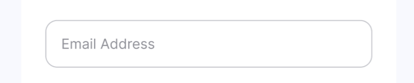
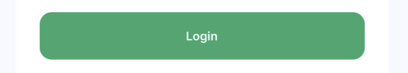
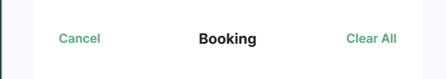
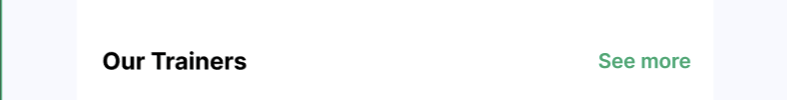


## Navigation


## API
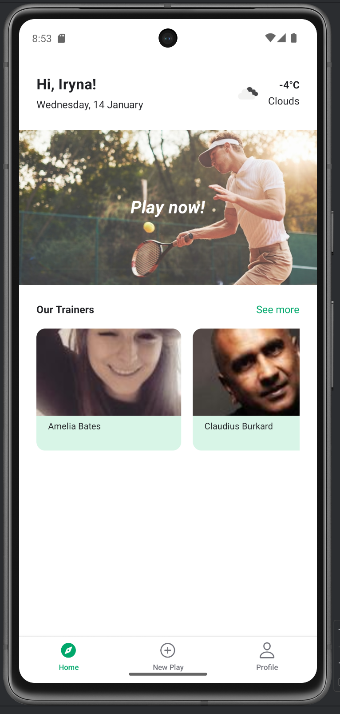
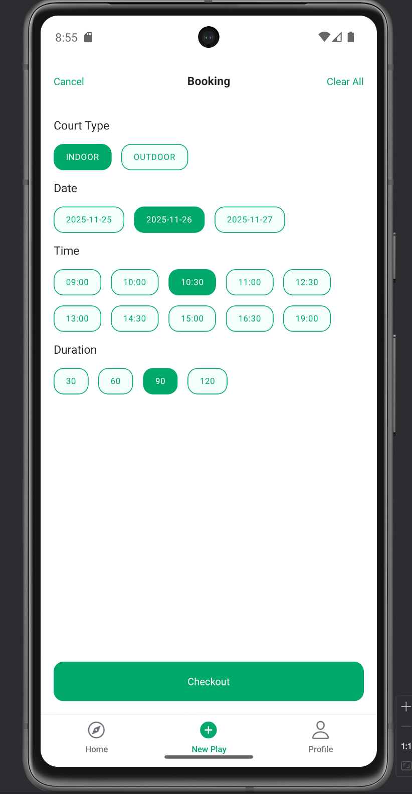
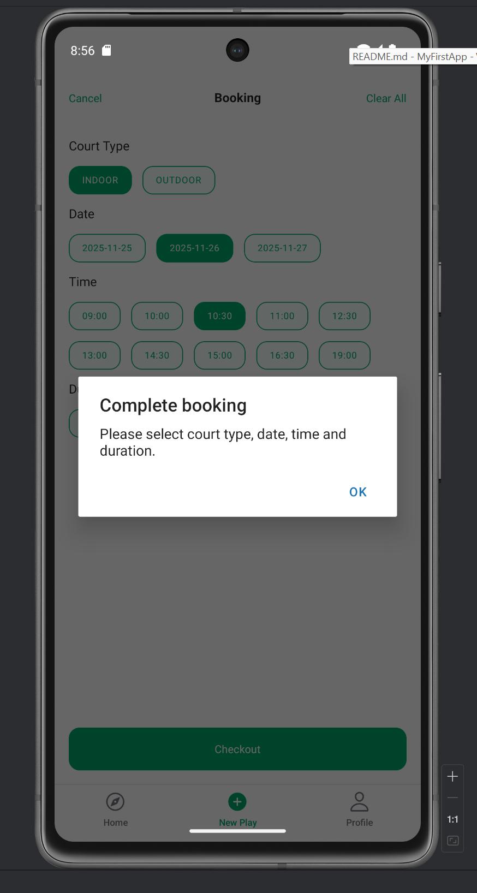
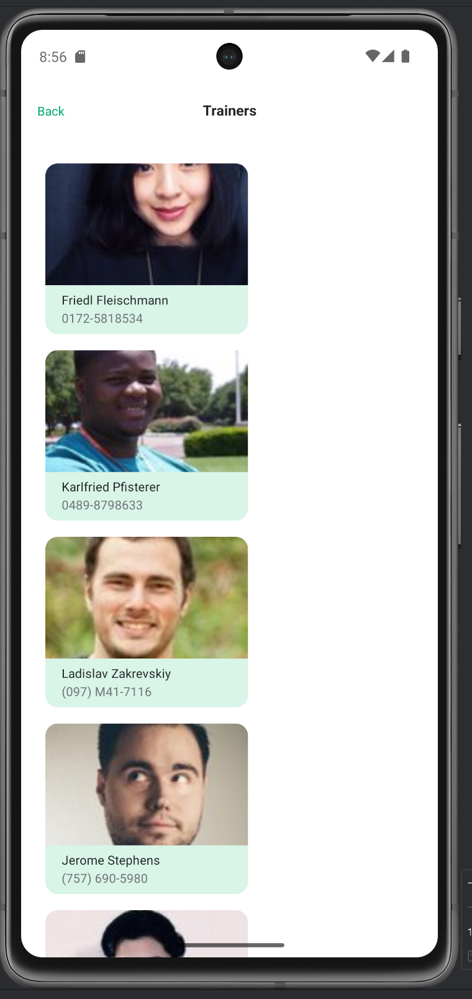

## Context API та Redux
React Native (Expo) app with global state management.
Context API: user profile data (name, phone, email) via UserContext
Redux Toolkit: booking state (court, date, time, duration)
State is used across multiple screens (Home, Booking, Profile)
Navigation integrated with Stack and Tabs

## Animation та Optimisation
Performance optimization applied:
- LayoutAnimation for trainers list appearance
- React.memo for TrainerCard to reduce re-renders
- useMemo and useCallback for stable props
- axios removed, native fetch used instead

## Cross Final Project

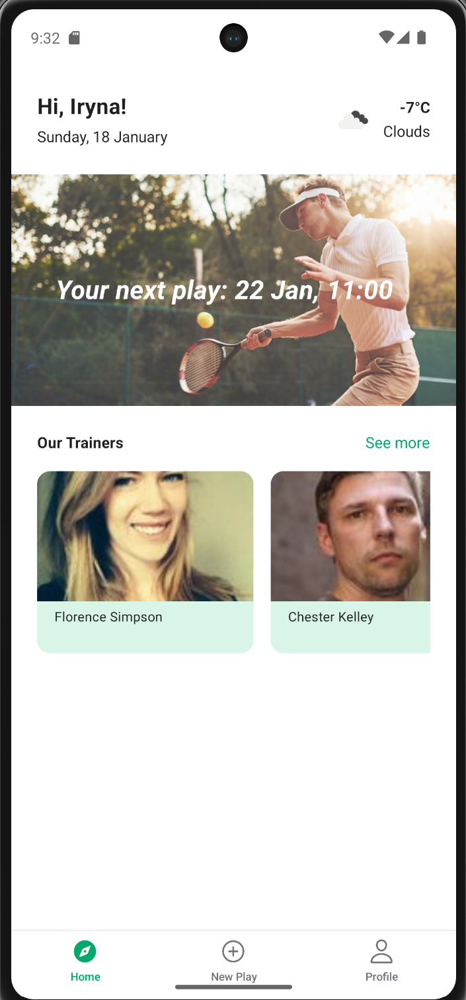
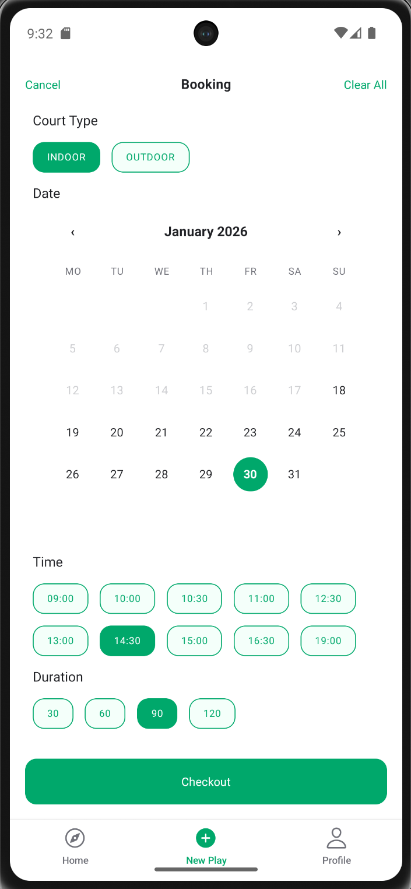
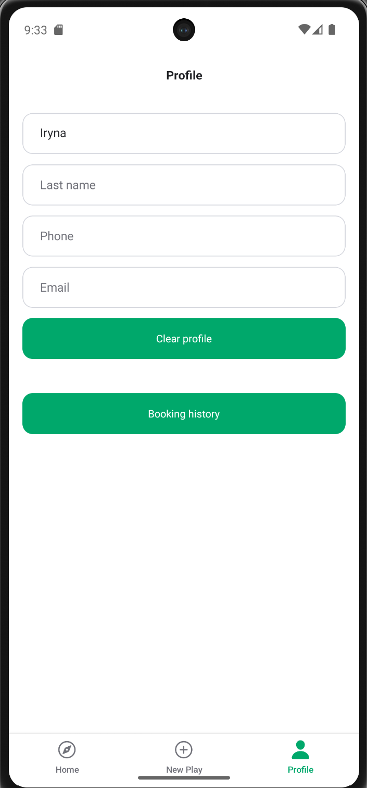
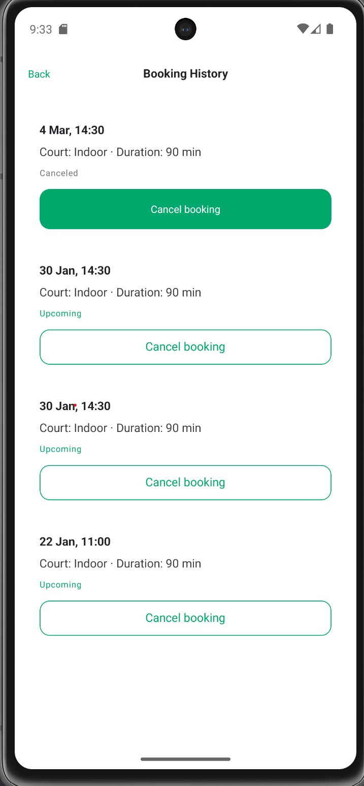


✅ Improvements in This Version

This project is an improved version of the initial court booking mobile application.
The goal was to enhance usability, extend functionality, and improve state management and UX.
🔹 New & Improved Features
- Extended booking flow: users can select court type, date (via calendar), time, and duration.
- Booking confirmation screen with final booking details.
- Booking History section in Profile showing all past and upcoming bookings.
- Cancel booking option for future bookings only (past bookings cannot be canceled).
- Dynamic Home banner that shows the next upcoming booking (e.g. “Your next play: 25 Jan, 15:00”). If no booking exists, default text “Play now!” is shown.
- External API integration (RandomUser.me) to display trainers as an additional service.
- Persistent user profile using AsyncStorage.

State Management Decisions

Two global state management approaches are used intentionally:

🔸 Context API — User Profile
Context API is used to store and manage user profile data:
- first name
- last name
- phone
- email

Reasoning:
User data is simple, global, and required in multiple screens (Home, Profile, Booking confirmation).
Context provides a lightweight and simple solution without unnecessary Redux complexity.
AsyncStorage is used to persist user data between app restarts.

🔸 Redux Toolkit — Booking & History
Redux is used to manage:
- current booking selections
- confirmed bookings
- booking history
- cancel actions

Reasoning:
Booking logic includes multiple actions (select, confirm, cancel, clear) and is shared across several screens
(Booking, Confirmation, Home banner, Profile history).
Redux provides predictable state transitions and centralized business logic.

🎨 UX / UI Improvements
Booking calendar prevents selecting past dates.
Confirmation flow gives clear feedback after booking.
Home screen banner reflects real user activity (next booking).
Navigation flow is optimized for main user scenario:
Home → Booking → Confirmation → Home → Profile History.

🧩 Component-Based Architecture
All major UI parts are separated into reusable components:
HomeHeader
HomeBanner
BookingCalendar
TrainerCard
ScreenHeader
PrimaryButton

This improves readability, maintainability, and scalability of the project.
📌 Next Possible Improvements
User authentication (registration & login flow).
Rescheduling existing bookings.
Push notifications before upcoming booking.
Real backend integration instead of mock APIs.